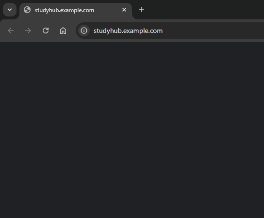

# StudyHub

*A productivity platform for students to organize resources, track progress, and collaborate with peers.*


## Description

StudyHub is a web application designed to help students manage their study materials, track their academic progress, and collaborate with classmates. It aims to simplify learning and make studying more productive and engaging.

Key highlights:
- Centralized resource organization.
- Task scheduling and reminders.
- Peer-to-peer collaboration for group projects.


## Motivation

During my time as a student, I often found it challenging to keep track of study materials and deadlines. StudyHub was created to solve this problem by offering a one-stop solution for students to organize their academic life seamlessly.


## Features

- User authentication and profiles.
- Resource library to upload and categorize study materials.
- Task management with deadlines and reminders.
- Collaborative workspaces for group projects.
- Integration with calendar apps for scheduling.


## Technologies Used

- **Frontend:** React, TailwindCSS
- **Backend:** Node.js, Express.js
- **Database:** MongoDB
- **APIs:** Google Calendar API


## Installation

Follow these steps to set up the project locally:

1. Clone the repository:
   ```bash
   git clone https://github.com/username/studyhub.git
    ```
2. Navigate to the project directory:
```bash
cd studyhub
```
3. Install dependencies:
```bash
npm install
```
4. Set up environment variables:
    - Create a .env file in the root directory.
    - Add the following:
    ```markdown
    MONGO_URI=<your-mongodb-uri>
    JWT_SECRET=<your-jwt-secret>
    ```
5. Start the development server:
    ```bash
    npm start
    ```
    
## Usage
- Register as a new user or log in with your credentials.
- Upload and organize study resources into categories.
- Use the task manager to schedule and track deadlines.
- Join or create collaborative workspaces for group projects.
- Live Demo: https://studyhub.example.com
- Example Screenshot:
    

## Challenges and Learnings
### Challenges:
- Integrating the Google Calendar API for task scheduling.
- Ensuring real-time updates in collaborative workspaces.
### Learnings:
- Improved knowledge of React state management with Context API.
- Learned efficient ways to structure MongoDB schemas for large datasets.

## Future Enhancements
- Develop a mobile app for StudyHub.
- Add AI-based study suggestions tailored to user preferences.
- Implement push notifications for deadlines and reminders.

## Contributing
We welcome contributions! Follow these steps to contribute:

1. Fork the repository.
2. Create a new branch:
```bash
git checkout -b feature-name
```
3. Commit your changes:
```bash
git commit -m "Add feature description"
```
4. Push to your branch:
```bash
git push origin feature-name
```
5. Open a pull request.


## Credits
- Lakshmi Nadh Makkena: Developer and project creator.
- X guy: Contributor (collaborative workspace feature).
- Resources: React Documentation, MongoDB Documentation.

## License
- This project is licensed under the MIT License. See the LICENSE file for details.